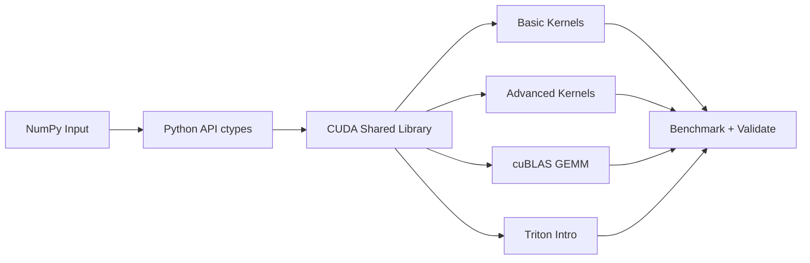

# mini-cuda-llm

一个面向初学者的 CUDA 算子学习仓库：代码短、路径清晰、可跑可测可对比。

从 `VectorAdd` 到 `Softmax/GEMM`，再到 `cuBLAS` 与 `Triton` 入门，帮助你一步步建立 GPU 编程直觉。

## 项目预览



## 学习路径

1. `VectorAdd basic`: 理解 kernel 启动与 H2D/D2H。
2. `VectorAdd advanced`: 缓存显存 + stream 异步。
3. `ReLU`: 逐元素深度学习激活算子。
4. `Softmax basic/advanced`: 数值稳定 + shared memory 归约。
5. `GEMM basic/advanced/cuBLAS`: 从朴素矩阵乘到工程级实现。
6. `Triton intro`: 用更高层 DSL 编写自定义 GPU kernel。

## 推荐阅读顺序（入门必看）

1. 先看接口总览：`include/kernels.h`
2. 再看基础数据流：`src/vector_add.cu`
3. 对比 advanced：`src/vector_add_advanced.cu`
4. 进入 DL 算子：`src/dl_ops.cu`
5. 进入核心 GEMM：`src/gemm.cu`
6. 最后看 Python 封装与测试：`python/mini_cuda_llm/api.py`、`python/mini_cuda_llm/perf_pipeline.py`
7. 进阶阅读 Triton：`python/mini_cuda_llm/triton_intro.py`

详细分阶段讲解见：`docs/CODE_READING_GUIDE_CN.md`
CUDA 与 Triton 逐行对照见：`docs/CUDA_TRITON_LINE_BY_LINE_CN.md`

## 目录结构

```text
mini-cuda-llm/
├── include/kernels.h
├── src/
│   ├── vector_add.cu
│   ├── vector_add_advanced.cu
│   ├── dl_ops.cu
│   └── gemm.cu
├── python/mini_cuda_llm/
│   ├── api.py
│   ├── validate.py
│   ├── benchmark.py
│   ├── benchmark_dl_ops.py
│   ├── benchmark_triton.py
│   └── triton_intro.py
└── scripts/monitor_gpu.sh
```

## 快速开始

### 1) 编译

```bash
cd /root/mini-cuda-llm
cmake -S . -B build
cmake --build build -j
```

### 2) 安装 Python 包

```bash
cmake --install build --prefix /root/mini-cuda-llm
python3 -m pip install -e python
```

### 3) 功能验证

```bash
python3 -m mini_cuda_llm.validate
```

### 4) 性能测试

```bash
python3 -m mini_cuda_llm.benchmark --size 1000000 --rounds 30 --warmup 5
python3 -m mini_cuda_llm.benchmark_dl_ops --rows 1024 --cols 1024 --rounds 20 --warmup 5
```

### 5) 一键测试流水线（推荐）

```bash
./scripts/run_perf_pipeline.sh
```

可选参数：

```bash
./scripts/run_perf_pipeline.sh /root/mini-cuda-llm/reports/latest 10 3
```

输出文件：

- `reports/latest/vector_add.csv`
- `reports/latest/dl_ops.csv`
- `reports/latest/results.json`
- `reports/latest/summary.md`
- `reports/latest/performance_overview.png`

## Triton 入门（可选）

安装（可选依赖）：

```bash
python3 -m pip install triton torch
```

快速试跑：

```python
import numpy as np
from mini_cuda_llm import triton_vector_add_numpy

a = np.array([1, 2, 3], dtype=np.float32)
b = np.array([4, 5, 6], dtype=np.float32)
print(triton_vector_add_numpy(a, b))
```

如果未安装 Triton，函数会给出明确提示，不影响 CUDA 主流程。

对照实验（同输入对比 CUDA advanced 与 Triton）：

```bash
python3 -m mini_cuda_llm.compare_cuda_triton
```

多规模基准（NumPy/CUDA/Triton）：

```bash
python3 -m mini_cuda_llm.benchmark_triton --sizes 100000,500000,1000000 --rounds 20 --warmup 5
```

## Triton vs CUDA：对比与优劣

| 维度 | CUDA C/C++ | Triton |
|---|---|---|
| 上手难度 | 较高，需要理解更多底层细节 | 较低，Python 语法更友好 |
| 开发效率 | 中等，模板和样板代码较多 | 高，写算子更快 |
| 可控性 | 最强，可细粒度控制 kernel 细节 | 较强，但受 Triton 抽象约束 |
| 生态成熟度 | 非常成熟（cuBLAS/cuDNN/NCCL 等） | 快速发展中，生态相对新 |
| 调优上限 | 极高，适合极限优化 | 高，很多场景够用 |
| 工程稳定性 | 生产验证充分 | 依赖版本兼容，需额外关注 |

### CUDA 的优势

- 工程级稳定，适合长期维护的大项目。
- 可直接对接 NVIDIA 官方高性能库（如 cuBLAS）。
- 对硬件行为可控度高，适合深度调优。

### CUDA 的不足

- 学习曲线陡，开发成本高。
- 样板代码和资源管理代码较多。

### Triton 的优势

- 写自定义算子速度快，原型迭代效率高。
- 代码表达更贴近“算子逻辑”，可读性好。
- 对深度学习场景（尤其融合算子）很友好。

### Triton 的不足

- 与 CUDA 官方库生态相比，通用性和成熟度仍在追赶。
- 对版本/环境兼容较敏感，部署时要更谨慎。
- 某些极致性能场景仍可能不如手工 CUDA + 专用库。

### 本项目中的建议

- 学习阶段：先 CUDA 基础，再读 Triton 对照实现。
- 原型阶段：优先 Triton，提高算子迭代效率。
- 生产阶段：关键路径优先 cuBLAS/cuDNN 或成熟 CUDA 实现。
- 评估原则：不要只看单次延迟，要同时看稳定性、维护成本和迁移成本。

## GPU 监控

```bash
./scripts/monitor_gpu.sh
```

等价命令：

```bash
watch -n 1 nvidia-smi
```

## 核心 API

- 向量加法：
    - `cuda_vector_add_numpy`
    - `cuda_vector_add_numpy_advanced`
- 激活与归一化：
    - `cuda_relu_numpy`
    - `cuda_softmax_numpy`
    - `cuda_softmax_numpy_advanced`
- 矩阵乘：
    - `cuda_gemm_numpy`
    - `cuda_gemm_numpy_advanced`
    - `cuda_gemm_numpy_cublas`
- Triton：
    - `triton_vector_add_numpy`

## 结果解读建议

- 看 `max abs diff`：先保证数值正确。
- 看 `basic/advanced`：理解手写优化收益。
- 看 `advanced/cuBLAS`：理解工程级库的性能差距。
- 配合 `nvidia-smi`：观察利用率和显存占用变化。

## 多角度分析框架

- 延迟维度：看 `latency_ms_*`、`gemm_ms_*` 的绝对值。
- 加速比维度：看 `speedup_*`，判断优化是否带来实质收益。
- 数值稳定性维度：看 `max abs diff` 是否可接受。
- 硬件效率维度：
    - VectorAdd: `gbps_*`（有效带宽）
    - GEMM: `gemm_gflops_*`（计算吞吐）

## 常见问题

- `cuda_runtime.h not found`: 检查 CUDA Toolkit 和 CMake CUDA 配置。
- Python 找不到 `.so`: 先执行 `cmake --install ...` 再 `pip install -e`。
- 小规模数据 GPU 不占优：传输开销可能大于计算收益，属正常现象。
- Triton 报错：先确认 `torch.cuda.is_available()` 为 True，且 `triton` 已安装。
