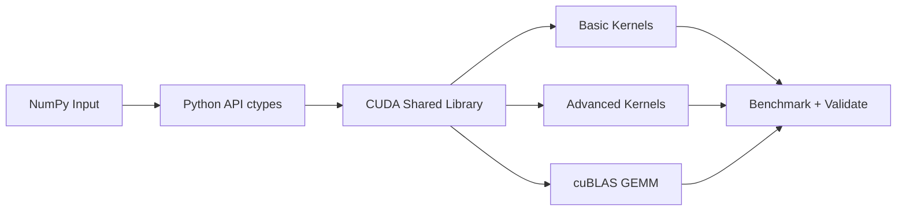

# mini-cuda-llm

一个面向 CUDA 入门到算子优化的微型项目：从 `VectorAdd` 走到 `Softmax/GEMM`，并提供 `basic -> advanced -> cuBLAS` 的可对比路径。

## 项目预览



## 学习路径

1. `VectorAdd basic`: 理解 kernel 启动与 H2D/D2H。
2. `VectorAdd advanced`: 缓存显存 + stream 异步。
3. `ReLU`: 逐元素深度学习激活算子。
4. `Softmax basic/advanced`: 数值稳定 + shared memory 归约。
5. `GEMM basic/advanced/cuBLAS`: 从朴素矩阵乘到工程级实现。

## 推荐阅读顺序（入门必看）

1. 先看接口总览：`include/kernels.h`
2. 再看基础数据流：`src/vector_add.cu`
3. 对比 advanced：`src/vector_add_advanced.cu`
4. 进入 DL 算子：`src/dl_ops.cu`
5. 进入核心 GEMM：`src/gemm.cu`
6. 最后看 Python 封装与测试：`python/mini_cuda_llm/api.py`、`python/mini_cuda_llm/perf_pipeline.py`

详细分阶段讲解见：`docs/CODE_READING_GUIDE_CN.md`

## 目录结构

```text
mini-cuda-llm/
├── include/kernels.h
├── src/
│   ├── vector_add.cu
│   ├── vector_add_advanced.cu
│   ├── dl_ops.cu
│   └── gemm.cu
├── python/mini_cuda_llm/
│   ├── api.py
│   ├── validate.py
│   ├── benchmark.py
│   └── benchmark_dl_ops.py
└── scripts/monitor_gpu.sh
```

## 快速开始

### 1) 编译

```bash
cd /root/mini-cuda-llm
cmake -S . -B build
cmake --build build -j
```

### 2) 安装 Python 包

```bash
cmake --install build --prefix /root/mini-cuda-llm
python3 -m pip install -e python
```

### 3) 功能验证

```bash
python3 -m mini_cuda_llm.validate
```

### 4) 性能测试

```bash
python3 -m mini_cuda_llm.benchmark --size 1000000 --rounds 30 --warmup 5
python3 -m mini_cuda_llm.benchmark_dl_ops --rows 1024 --cols 1024 --rounds 20 --warmup 5
```

### 5) 一键测试流水线（推荐）

```bash
./scripts/run_perf_pipeline.sh
```

可选参数：

```bash
./scripts/run_perf_pipeline.sh /root/mini-cuda-llm/reports/latest 10 3
```

输出文件：

- `reports/latest/vector_add.csv`
- `reports/latest/dl_ops.csv`
- `reports/latest/results.json`
- `reports/latest/summary.md`
- `reports/latest/performance_overview.png`

## GPU 监控

```bash
./scripts/monitor_gpu.sh
```

等价命令：

```bash
watch -n 1 nvidia-smi
```

## 核心 API

- 向量加法：
    - `cuda_vector_add_numpy`
    - `cuda_vector_add_numpy_advanced`
- 激活与归一化：
    - `cuda_relu_numpy`
    - `cuda_softmax_numpy`
    - `cuda_softmax_numpy_advanced`
- 矩阵乘：
    - `cuda_gemm_numpy`
    - `cuda_gemm_numpy_advanced`
    - `cuda_gemm_numpy_cublas`

## 结果解读建议

- 看 `max abs diff`：先保证数值正确。
- 看 `basic/advanced`：理解手写优化收益。
- 看 `advanced/cuBLAS`：理解工程级库的性能差距。
- 配合 `nvidia-smi`：观察利用率和显存占用变化。

## 多角度分析框架

- 延迟维度：看 `latency_ms_*`、`gemm_ms_*` 的绝对值。
- 加速比维度：看 `speedup_*`，判断优化是否带来实质收益。
- 数值稳定性维度：看 `max abs diff` 是否可接受。
- 硬件效率维度：
    - VectorAdd: `gbps_*`（有效带宽）
    - GEMM: `gemm_gflops_*`（计算吞吐）

## 常见问题

- `cuda_runtime.h not found`: 检查 CUDA Toolkit 和 CMake CUDA 配置。
- Python 找不到 `.so`: 先执行 `cmake --install ...` 再 `pip install -e`。
- 小规模数据 GPU 不占优：传输开销可能大于计算收益，属正常现象。
