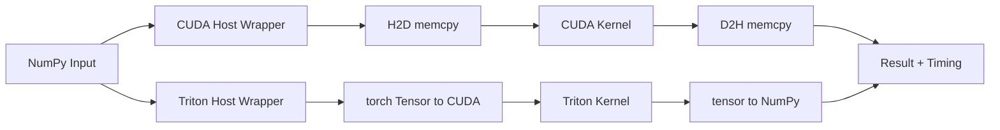

# CUDA vs Triton 逐行对照（完整版）

目标：围绕同一个 `VectorAdd`，把 CUDA 与 Triton 从 Host 到 Kernel 全链路对齐，帮助你同时建立两套技能。

## 1) 一图看全流程



## 2) Kernel 逐行对照

### CUDA C kernel

```cpp
// C1: kernel 定义
__global__ void vectorAddKernel(const float* a, const float* b, float* c, int n) {
    // C2: 计算全局索引
    int idx = blockIdx.x * blockDim.x + threadIdx.x;

    // C3: 边界保护
    if (idx < n) {
        // C4: 计算与写回
        c[idx] = a[idx] + b[idx];
    }
}
```

### Triton kernel

```python
# T1: kernel 定义
@triton.jit
def vec_add_kernel(x_ptr, y_ptr, out_ptr, n_elements, BLOCK_SIZE: tl.constexpr):
    # T2: program id，功能上接近 CUDA 的 blockIdx.x
    pid = tl.program_id(axis=0)

    # T3: 当前 program 负责的连续索引区间
    offsets = pid * BLOCK_SIZE + tl.arange(0, BLOCK_SIZE)

    # T4: 边界掩码
    mask = offsets < n_elements

    # T5: 载入 -> 计算 -> 写回
    x = tl.load(x_ptr + offsets, mask=mask)
    y = tl.load(y_ptr + offsets, mask=mask)
    out = x + y
    tl.store(out_ptr + offsets, out, mask=mask)
```

### 语义映射表

| CUDA | Triton | 含义 |
|---|---|---|
| C1 | T1 | 定义 GPU kernel |
| C2 | T2+T3 | 计算当前执行单元负责的数据索引 |
| C3 | T4 | 越界保护 |
| C4 | T5 | 核心算子逻辑 |

## 3) Host 侧逐段对照

### CUDA Host（概念化）

```cpp
// H1: 申请显存
cudaMalloc(&d_a, bytes);
cudaMalloc(&d_b, bytes);
cudaMalloc(&d_c, bytes);

// H2: H2D
cudaMemcpy(d_a, h_a, bytes, cudaMemcpyHostToDevice);
cudaMemcpy(d_b, h_b, bytes, cudaMemcpyHostToDevice);

// H3: 启动 kernel
vectorAddKernel<<<blocks, threads>>>(d_a, d_b, d_c, n);
cudaDeviceSynchronize();

// H4: D2H
cudaMemcpy(h_c, d_c, bytes, cudaMemcpyDeviceToHost);

// H5: 释放资源
cudaFree(d_a); cudaFree(d_b); cudaFree(d_c);
```

### Triton Host（概念化）

```python
# H1: NumPy -> torch CUDA tensor
x = torch.from_numpy(a).to("cuda")
y = torch.from_numpy(b).to("cuda")
out = torch.empty_like(x)

# H2: 配置 grid 并启动 kernel
grid = lambda meta: (triton.cdiv(n, meta["BLOCK_SIZE"]),)
vec_add_kernel[grid](x, y, out, n, BLOCK_SIZE=1024)

# H3: 回传
result = out.cpu().numpy()
```

### Host 映射表

| CUDA Host 步骤 | Triton Host 步骤 | 核心差异 |
|---|---|---|
| 手动 `cudaMalloc` | `torch` tensor 自动管理 | Triton 侧样板代码更少 |
| 手动 `cudaMemcpy` | `.to("cuda")` / `.cpu()` | 框架封装了传输细节 |
| `<<<blocks,threads>>>` | `kernel[grid](...)` | 表达方式不同，本质相同 |
| 手动 `cudaFree` | 张量生命周期管理 | Triton 更接近 Python 习惯 |

## 4) 启动参数对照

### CUDA

```cpp
int threads = 256;
int blocks = (n + threads - 1) / threads;
vectorAddKernel<<<blocks, threads>>>(...);
```

### Triton

```python
grid = lambda meta: (triton.cdiv(n, meta["BLOCK_SIZE"]),)
vec_add_kernel[grid](..., BLOCK_SIZE=1024)
```

记忆方式：

- `threads/block` <=> `BLOCK_SIZE`
- `blocks` <=> `grid(program count)`

## 5) 优劣与适用场景（结合本项目）

### CUDA 更适合

- 需要精细控制 kernel/内存/流。
- 需要稳定接入 cuBLAS/cuDNN 等成熟库。
- 对生产可维护性和生态兼容要求高。

### Triton 更适合

- 快速迭代自定义算子原型。
- 希望用更少样板代码表达算子逻辑。
- 做研究验证或融合算子探索。

## 6) 常见误区

1. `Triton 一定更快`
   不一定，性能取决于算子类型、数据规模、内存模式和调参。

2. `只看 kernel 时间`
   入门阶段建议同时看端到端时间（含传输和调度）。

3. `误差就是错误`
   FP32 下小量级误差通常正常，需结合容差判断。

## 7) 对照实验与观察点

运行命令：

```bash
python3 -m mini_cuda_llm.compare_cuda_triton
```

建议记录：

1. CUDA advanced 延迟
2. Triton 延迟
3. `max abs diff`
4. 运行时 GPU 利用率（配合 `watch -n 1 nvidia-smi`）

## 8) 进阶练习（同时提升两种技能）

1. 把 `BLOCK_SIZE` 从 `1024` 改为 `256/512`，比较 Triton 延迟变化。
2. 把 CUDA `threadsPerBlock` 改为 `128/256/512`，比较趋势。
3. 对齐两边参数后，分析谁更受内存带宽限制。

完成后你会形成一套可迁移能力：

- 能读 CUDA 低层实现
- 能写 Triton 高效原型
- 能通过基准数据做技术选型
